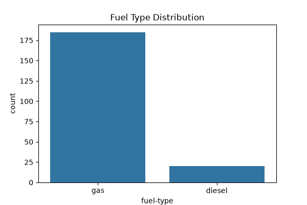
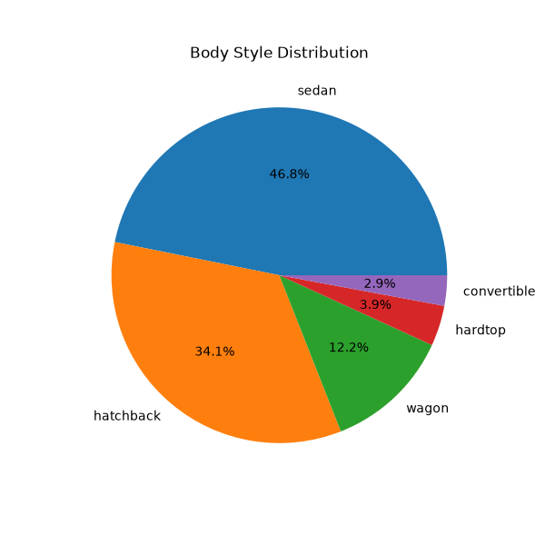
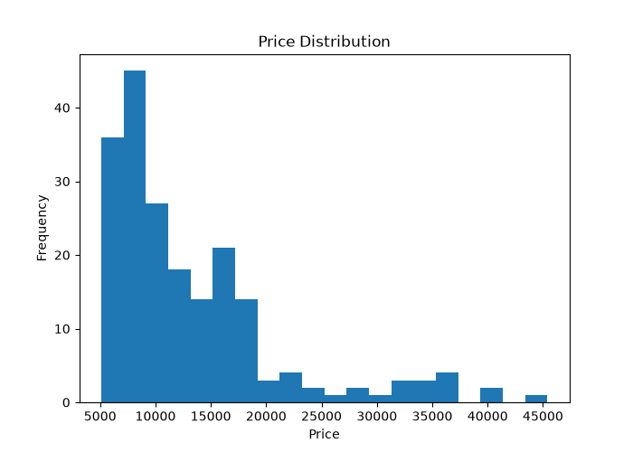
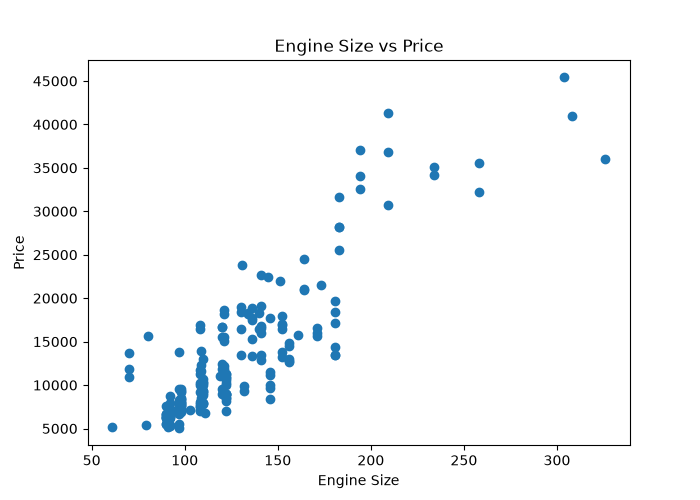
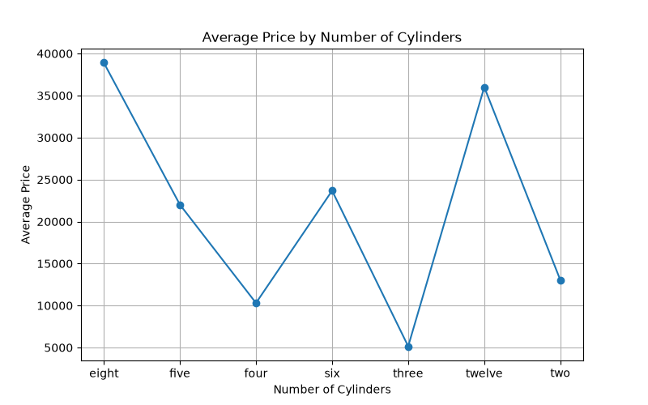
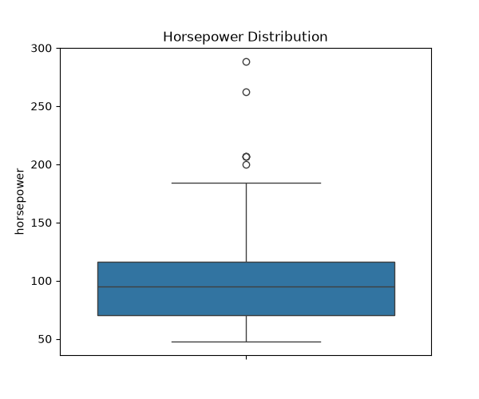

# 🚗 Automobile Dataset Analysis

## 📌 Project Overview

This project performs **Exploratory Data Analysis (EDA)** on the Automobile Dataset using Python. It includes reading the dataset, identifying attribute types, calculating dissimilarity measures, and visualizing the data using various graphs.

---

## 🛠️ Technologies Used

- Python
- Pandas
- NumPy
- Matplotlib
- Seaborn
- SciPy

---

## 📂 Project Structure

```
Automobile-fds-2/
│
├── Automobile_data.csv
├── read.py
├── identify_att.py
├── dissimilarity.py
├── visualization.py
├── requirements.txt
├── README.md
│
└── graphs/
    ├── fuel_type_bar.png
    ├── body_style_pie.png
    ├── price_histogram.png
    ├── engine_vs_price.png
    ├── avg_price_cylinders.png
    └── horsepower_boxplot.png
```

---

## 📊 Features

- Read and inspect the dataset
- Identify Numeric, Categorical and Binary attributes
- Calculate dissimilarity measures
- Generate six different visualizations
- Save graphs automatically in the **graphs** folder

---

# 📈 Graphs

## 1. Fuel Type Distribution



---

## 2. Body Style Distribution



---

## 3. Price Distribution



---

## 4. Engine Size vs Price



---

## 5. Average Price by Number of Cylinders



---

## 6. Horsepower Distribution



---

## ▶️ How to Run

Install the required libraries:

```bash
pip install -r requirements.txt
```

Run the programs:

```bash
python read.py
python identify_att.py
python dissimilarity.py
python visualization.py
```

---

## 👨‍💻 Author

**Subrat Kumar Rath**

GitHub: https://github.com/Subratkumarrath15

Repository: https://github.com/Subratkumarrath15/Automobile-fds-2